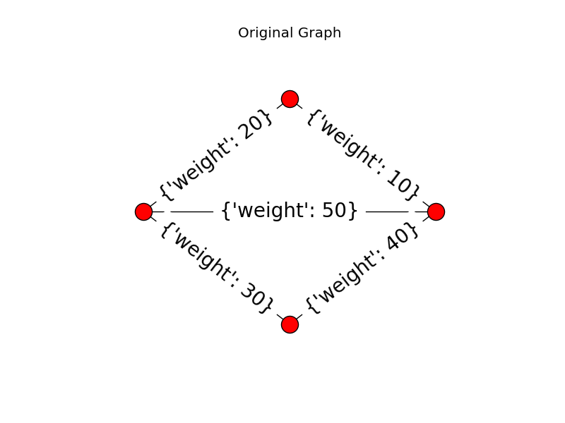

# Supplemental Final Report
***David West*** 
May 12, 2016

-------------------

**Table of Contents:**
- [Overview](./SupplementalReport-DW.md.md#overview)
- [Description of Region Adjacency Graphs]()
  - [Region Adjacency Overview]()
  - [Initial Considerations and Attempts]()
  - [Non-Linear Edge Weighting]()
  - [Normalized, Linear Edge Weighting]()
- [Trends in Graph Connectivity Using Mean Edge Weights]()

## Overview
This supplemental final report explores the synaptic density data further. The [primary final report](https://github.com/Upward-Spiral-Science/uhhh/blob/master/FinalReport.md#final-report-uhhh) was prepared on May 5, 2016, and examines data taken from 2011 M. musculus V1 dataset from Network anatomy and in vivo physiology of visual cortical neurons (Bock et al). Amongst a few key insights, a primary finding of the initial analyses was that the y-axis of the 3D volume was aligned with the z-axis of the brain, or the axis along which cortical layers vary. The report found key inflection points in synaptic density down the volume's y-axis. The report also offered a cursory analysis of clustering and trends in synaptic distribution down the y-axis, as well as through the x and z axes.

The analyses in this report seeks to answer questions about the properites of the data, primarily considering how the arrangement of synapses differs along the y-axis of the image. Namely, we ask:

* _What other features besides simple synaptic density can be used to describe the tissue?_
* _Using these features, what trends arise as we traverse into deeper cortical layers?_
* _Do any features discriminate boundaries between layers?_
* _If so, do these features discriminate between the boundaries as well, or better than mean or max synaptic density, as described in the earlier report?_

In our [initial questions](https://github.com/Upward-Spiral-Science/uhhh/blob/master/draft/questions.md) we suggested that graphs might be constructed on the data. To open up our domain of possible features used to describe the tissue, we construct graphs and measure properties of those graphs.

## Description of Region Adjacency Graphs (RAG)

### Initial Considerations and Attempts
An initial thought was to construct Delaunay and/or its dual Voronoi graphs. However, these graphs consider only  spatial information. Because the supervoxels are evenly spaced, and because our "resolution" of information is only as high as these supervoxels, spatial-only graphs provide no additional insight. We must consider density information as well. A first attempt was to construct the Delaunay in such a way that used distance between synaptic weights as the criteria for putting an edge between supervoxel nodes. In other words, we would be constructing the graph in _density space_. However, this would be  accounting for density information alone, and likely no more insightful than the analysis of the first report. 

### Region Adjacency Overview
To construct a graph that consider both spacial and density information, we'll use a Region Adjacency Graph (RAG). RAGs are used largely in image processing, and it makes sense for our data to look more like an image. Since the data is evenly spaced, the _absolute_ locations of the voxels don't matter. We can use the index in the matrix to represent spacial location, with the value at each pixel being the synapse density at that voxel. We've done this before in `real volume`.

In RAGs, two nodes are considered as neighbor if they are close in proximity (separated by a small number of pixels/voxels) in the horizontal or vertical direction. RAGs sometimes consider diagnonally "adjacent" pixels, but for these analyses, we only consider the horizontal and vertical neighbors.

### Non-Linear Edge Weighting
When two nodes are established as neighbors, the edge between the nodes is weights. Since our data includes density values at each node (voxel, or pixel since we're looking at y-layers), we can weight by the inverse of density difference between two nodes. Inverse because strongly connected nodes should be close in weight. We have number of synapses Si at nodes $i$ and define weights $w$ between the nodes:

$$w_j = \dfrac{1}{|S_i - S_{i+1}|}$$

Multiple analyses were performed using RAGs generated by this edge weighting function. Note that this function decays nonlinearly with absolute density difference.

### Normalized, Linear Edge Weighting
Another way to weight the graphs would be to pick a funtion that decays linearly with density distance from 1 to 0. In the nonlinear weighting function there appeared to be some edge effect behavior that causes that rapid change in statistics in deeper y-layers. To do this, we would need to scale the edge weights such that ${|S_i - S_{i+1}|}_{max}$ for each layer is scaled to 1 and ${|S_i - S_{i+1}|}_{min}$ is scaled to 0. The function we use to accomplish this is:

$$w_j = 1- (\dfrac{1}{{|S_i - S_{i+1}|}_{max} - {|S_i - S_{i+1}|}_{min}})*|S_i - S_{i+1}|$$

Note the scaling term $\dfrac{1}{{|S_i - S_{i+1}|}_{max} - {|S_i - S_{i+1}|}_{min}}$. The max and min synaptic density differences are calculated for each layer (as opposed for the whole volume).
 
 ## Exploratory Analysis
We 
 

## Trends in Graph Connectivity Using Mean Edge Weights
The edge weights are a measure of connectivity. Thus, we want to see how connectivity changes through the y-layers, which we confidently believe represents deeper cortical layers. We'll start by taking the mean edge weight for each layer as a measure of connectivity for that layer.

_**Note: Connectivity here is not referring to connectivity in the neuroscience sense, but rather in the graph theory sense. Closely "connected" supervoxels are closer in density, but might both be low in absolute synaptic density, and thus less connected in the neuroscience sense. For the purposes of this analysis, I'll generally consider connectivity to be graph connectivity unless otherwise stated."**_

While it is difficult to see any kind of pattern that might quantitatively separate cortical layers as we saw in the simple mean density plots through the y-axis, we do see a trend in increasing mean edge weights as we get deeper into the y-layers. Specifically, we can see below that connectivity increases about 33% between the first and last layer considered (layer 0 and 39). Remember that we found that the the tissue becomes less dense as we traverse down the y-axis [(see here)](https://github.com/Upward-Spiral-Science/uhhh/blob/master/FinalReport.md#generating-a-plot-of-synaptic-density-as-a-function-of-cortical-depth). So at the least, we see that as tissue becomes less dense, the connectivity of the RAG increases.

### Further Understanding the Mean Connectivity and RAG in General
These results are intriguing. Why would connectivity (as we define it) increase with cortical depth as the tissue becomes less synaptically-dense? Let's look at this further.

#### Impact of Sparse Image Layers
Because edge weight is a function of difference in density for neighboring supervoxels, the increase in average edge weight might be due to the fact that the distribution of synapses throughout the tissue is becoming more sparse, and thus more irregular throughout the tissue. It's worth noting that we have already eliminated the possibility of edge effects. Namely, since deepest 12 y-layers are matrices of nearly all 0's with some noise, one would expect that the edge means would be very high. Indeed, we can see below that when we put those edges back in, there is a large spike in the last 12 layers when padding becomes relevant.

#### Correlation with Density Variance
In interpreting this RAG, let's hypothesize that graph connectivity is negatively correlated with density variance. It's reasonable to expect that higher variance in density would translate into an increased probability of having two very different supervoxels next to each other, and thus lower graph connectivity. To check this, let's look at the trend in variance.

Indeed, as variance increases, connectivity decreases - it's more likely that there is a higher difference in synaptic density in neighboring super pixels with higher variance. We can see this correlation quantitatively with `Pearson's coefficient: -0.8581 `between the density variance and mean edge weight. 

#### Interpretation and Concluding Nonlinear Mean Connectivity
Indeed, we have a very strong negative correlation between density variance and mean graph connectivity through the y-layers. However, note that it is not a perfect correlation. Mean edge weight tells us something slightly different than simple density variance. This could likely be due to a few properties of the RAG as we calculated it.

1. The RAG considers differences in synaptic density for supervoxels in close spatial proximity to each other. Thus, in a way, connectivity measures local clustering, whereas density variance gives no consideration to locality. This might a reason why graphs can add more information than whole-layer density statistics considered in previous analyses (main final report).
2. The edge weights are given by a non-linear function of synaptic density distance where $$w = \dfrac{1}{|S_i - S_{i+1}|}$$
3. The weighting function is not normalized by the range of density differences within each layer. 

Thus, to points 2 and 3, it would be interesting to see how a different weighting function that is linear and normalized by layer looks. Perhaps we can see trends in the data that could act as a feature that not only shows how density and clustering changes through the cortical layers, but also discriminates between those layers.

### Mean Connectivity with Linear Weighting
As mentioned in Exploratory Analysis, weighting edges as a linear function of distance means that connectivity in sparse layers will be stronger, and thus perhaps a better measure of density similarity between neighboring pixels. We also hypothesized that scaling by the range of density distances for each layer would eliminate the effects of sparse layers and would measure supervoxel similarity/"connectivity" without the noise added by sparse layers. To test this hypothesis, we can look mean edge weights by y-layers in the regions which we know to be artificially sparse due to padding in the data (note, it's unclear exactly why these edge effects exist, but it provides a useful opportunity for validation of our metric).

As we can see, there are still _some_ effects casued by sparse layers, but these effects are substantially suppressed compared to that of the non-linear weighting function.

We can see that the linear weighing function eliminated the increasing connectivity trend through the layers. Mean edge weights under the linear function have a `Pearson Correlation: -0.10966` with density variance through the layers. So we can see that the linear function is not measuring variance or sparsity. Perhaps, then, this is telling us something different.

#### Seeking Boundary Discriminating Features
One of our objectives is to seek features of the data that might distinguish between cortical layers. In early analysis, we say that local minima in layer density sums provided distinct boundaries.

> 
> <small>Figure: The above figure is separated by local minima in the density sums. Local minima were found at layers 2,  6, 12, 18, 24, 30, 34. Note that a threshold for minima was set relative to the data, so not all true local minima were considered. </small>

In examining linearly-weighted edge weight means, we found local minima at layers 1,  6,  8, 11, 14, 18, 20, 23, 25, 28, 30, 33, and 37. Clearly, this does not agree with earlier analyses determining boundaries. We also looked at local maxima, which were found at layers 1,  6,  8, 11, 14, 18, 20, 23, 25, 28, 30, 33, and 37. Again, and as demonstrated visually below, mean edge weight on the linearly-weighted region adjacency graphs does not provide a useful metric for discriminating between layer boundaries.

## Other Features for Cortical Layer Discrimination and Cortical Depth
As demonstrated, mean edge weight nonlinear RAG is strongly correlated with density variance and is a useful feature in determining cortical depth. Linearly-weighed RAGs do not seem to provide any significant trend with cortical depth. However, the mean edge weight statistic on *neither* RAG's distribution provides significant feature for cortical layer discrimination.

### Connectivity Variance
In examining connectivity variance through the y-layers, we can see again that there is no apparent trend in the linearly-weighted edge RAG. The nonlinear function, however, shows a trend in increasing connectivity variance. Perhaps most interesting are the maxima at layers 15 and 35, accompanied by apparent shifts in the variance trend. These inflection points are very close to the boundaries discussed in the initial final report.

> 

We postulate that the initial increase in graph connectivity variance from image-layers 0 to ~15 represent V1 Layer I in the cortex, with the boundary between Layer I and layer II existing in that region of image-layers 14-16. It makes sense that we would see an increase in graph variance at the boundary.

### Higher Order Statistics
Furthermore, examining higher order statistics, namely the third and fourth moments of the RAG edge weight distributions show similar results. The linearly weighted RAG

> 

> 

