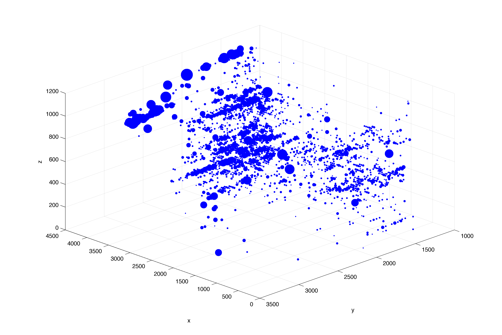

## Progress Report — March 24th, 2016

> ~~Stolen~~ Adapted from [prior work](https://github.com/Upward-Spiral-Science/grelliam) by Greg Kiar.

**Table of Contents:**
- [Overview](./progress_report.md#overview)
- [Scientific Questioning](./progress_report.md#scientific-questioning)
  - [Decriptive Analysis](./progress_report.md#descriptive-analysis)
  - [Exploratory Analysis](./progress_report.md#exploratory-analysis)
  - [Inferential Analysis](./progress_report.md#inferential-analysis)
  - [Predictive Analysis](./progress_report.md#predictive-analysis)
  - [Testing Assumptions](./progress_report.md#testing-assumptions)
  - [Next Steps](./progress_report.md#next-steps)

----------

### Overview
Our research aims to address two main points in the areas of connectomics. The first is that of making the large-scale data that is now at our disposal more tractable. Modern connectomics is largely blocked by the enormity of collected data. We posit that these data can be 'reduced' by ignoring areas that are low in synaptic density — a generalization we aim to prove later in study. Furthermore, we posit that if we can model a 3D structure of synaptic density across cortex, brain scans can be greatly simplified by effectively ignoring certain areas when scanning at high resolution — areas that are expected to be low in synaptic density, and thus low in connectomic 'importance.'

Secondly, we intend to show that synapses follow a non-uniform, predictable distribution in mammalian cortex (here, in *M. musculus*, though we anticipate this pattern being reproduced in primates as well). If such a macroscopic pattern exists, it is possible that we can shed light on the debate surrounding the existance of cortical columns in brain areas outside sensory cortex — a notable find in the quest for a brain map.

### Scientific Questioning
In this section, we discuss our early investigations into the nature of our data, as well as early hypotheses and questions posed. We then substantiate these with supplementary code (as provided in [this repository](https://github.com/Upward-Spiral-Science/uhhh).

#### Descriptive Analysis
Our data are available at [this address](https://github.com/Upward-Spiral-Science/uhhh/blob/master/data/data.csv). Upon first examination of the data, it is clear that the CSV spans a spatial array in three dimensions (with voxel coordinates represented by columns 0, 1, and 2, in xyz-space, respectively).

After further investigation and personal conversation with @jovo, we established the meaning of `unmasked` to mean the following:

Given a *supervoxel* of edge-lengths *a, b, c*, where each is an integer count of constituent voxels, the supervoxel has an unmasked value of *n* ∈ 0..(a × b × c), indicating how many of the constituent "member" voxels fall outside of a *masked* region, or a region in which it is known no voxels exist.

That is, a voxel with an `unmasked` value of (a × b × c) can be considered as correct of a representation of synapse-count as possible, whereas an `unmasked` value of 0 indicates that, despite empirical figures, it is known by the data collector that no synapses fall in this zone. Biologically speaking, this likely means that the machine-recognized 'synapses' were either computational artifacts, or existed in a synapse-free zone, such as inside a cell or a region not in contact with a cell-membrane.

Further examination indicated that our data were cuboidal and complete — that is, all supervoxels between *dmin..dmax* are accounted for, for each dimension *d*. (Simply; there are no holes in our 3D matrix.)

#### Exploratory Analysis
Now that we had an intuition regarding the meaning and validity of our data, we were able to further explore our data as follows:

First, we wished to know such basic information as the average synapse count per supervoxel. This was found to be 125 synapses per supervoxel if all voxels were considered. If fully masked supervoxels were discounted, this average was found to be 140. [[source]](https://github.com/Upward-Spiral-Science/uhhh/blob/master/code/Average%20Synapses%20Over%20Volume.ipynb) In other words, if a supervoxel had *any* synapses in it, expected value was ≈140.

In order to establish a more accurate understanding, we then calculated variance, which we found to be 8463.5 if including all supervoxels, 0.0 if including only masked, and the predictably-lower 7394.1 if including only unmasked>0 [[source]](https://github.com/Upward-Spiral-Science/uhhh/blob/master/code/Average%20Synapses%20Over%20Volume.ipynb).

Here we explore the nature of our data (visualized from the z-top in max-intensity projection):

    

    

          
        <small><b>Fig 1: Maximum intensity projection from top of z-axis.</b></small>
    

    

As you can see, the data are clearly not uniformly distributed. For our further exploration, we ignored all boundaries ±15 voxels in order to prevent inaccurate representation of our data due to edge-effect.

Furthermore, we can visualize these synapse densities in 3D — a calculation that has (mercifully) already been performed because my Macbook Air just choked like hella while trying to run that code.

    

    

          
        <small><b>Fig 2: 3D distribution of synapses.</b> Here, we visualize synapse distribution in 3D. Imagery courtesy of [NeuroData](http://docs.neurodata.io/ndintro/images/3D.png).</small>
    

    

#### Inferential Analysis
Next we decided to develop models to infer more about the nature of our dataset. We first plotted the distribution of our data 'bins' after unraveling our 3D matrix (i.e. ignoring dimension and location).

    

    

        A.   
        B.   
        <small><b>Fig 3: A. Distribution of bins.</b> The *x* axis represents the number of synapses in the supervoxel, while the height of the bar represents the number of voxels. <b>B.</b> After voxels with a value of `0` are removed.</small>
    

    

These figures and their constituent data are available [here](https://github.com/Upward-Spiral-Science/uhhh/blob/master/code/%5BAssignment%204%5D%20Model%20and%20Assumptions.ipynb).

Our resultant understand was that our voxels' synaptic density distrubution was non-uniform, and furthermore, we estimated that our data follow a mix of a Gaussian and exponential distribution (in 1D). More of this is discussed in the subsequent section.

#### Predictive Analysis
As noted below, this is a major area for improvement. We began a misguided regression approach to prediction synapse density, but ultimately ran into roadblocks. One of the challenges with our approach was in understanding how to lay out a prediction problem to solve given our data. Becuase it is from a single section of tissue, and the data is limited to only density, we were unable to address our intial idea of predicting disease state using graph features. Going forward, in the past week, we broke up our data into layers and began examining the discrepencies in distributions, and re-framing our prediction goals.

#### Testing Assumptions
In out initial framing of the problem, we sought to show that synapse density was not uniform random. This is clearly not the case, so we wanted to test our revisised model that assumes our data is drawn from 2 distributions. We used a non-parametric kernal density estimation to estimate the parameters of the distributions.

#### Next Steps
We have inspected our data outside of 3D space in one dimension, which, while informative, is less meaningful than an inspection of synapses in 3D space. Subsequent work will focus on predicting 3D regions of high synaptic density as well as predicting areas of low density — useful in the aforementioned journey to simplify the process of neuroimaging at scale. We 
