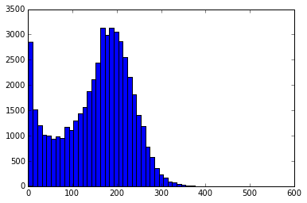

## Progress Report — March 24th, 2016

> ~~Stolen~~ Adapted from [prior work](https://github.com/Upward-Spiral-Science/grelliam) by Greg Kiar.

**Table of Contents:**
- [Overview](./progress_report.md#overview)
- [Scientific Questioning](./progress_report.md#scientific-questioning)
  - [Decriptive Analysis](./progress_report.md#descriptive-analysis)
  - [Exploratory Analysis](./progress_report.md#exploratory-analysis)
  - [Inferential Analysis](./progress_report.md#inferential-analysis)
  - [Predictive Analysis](./progress_report.md#predictive-analysis)
  - [Testing Assumptions](./progress_report.md#testing-assumptions)
  - [Next Steps](./progress_report.md#next-steps)

----------

### Overview
Our research aims to address two main points in the areas of connectomics. The first is that of making the large-scale data that is now at our disposal more tractable. Modern connectomics is largely blocked by the enormity of collected data. We posit that these data can be 'reduced' by ignoring areas that are low in synaptic density — a generalization we aim to prove later in study. Furthermore, we posit that if we can model a 3D structure of synaptic density across cortex, brain scans can be greatly simplified by effectively ignoring certain areas when scanning at high resolution — areas that are expected to be low in synaptic density, and thus low in connectomic 'importance.'

Secondly, we intend to show that synapses follow a non-uniform, predictable distribution in mammalian cortex (here, in *M. musculus*, though we anticipate this pattern being reproduced in primates as well). If such a macroscopic pattern exists, it is possible that we can shed light on the debate surrounding the existance of cortical columns in brain areas outside sensory cortex — a notable find in the quest for a brain map.

### Scientific Questioning
In this section, we discuss our early investigations into the nature of our data, as well as early hypotheses and questions posed. We then substantiate these with supplementary code (as provided in [this repository](https://github.com/Upward-Spiral-Science/uhhh).

#### Descriptive Analysis
Our data are available at [this address](https://github.com/Upward-Spiral-Science/uhhh/blob/master/data/data.csv). Upon first examination of the data, it is clear that the CSV spans a spatial array in three dimensions (with voxel coordinates represented by columns 0, 1, and 2, in xyz-space, respectively).

After further investigation and personal conversation with @jovo, we established the meaning of `unmasked` to mean the following:

Given a *supervoxel* of edge-lengths *a, b, c*, where each is an integer count of constituent voxels, the supervoxel has an unmasked value of *n* ∈ 0..(a × b × c), indicating how many of the constituent "member" voxels fall outside of a *masked* region, or a region in which it is known no voxels exist.

That is, a voxel with an `unmasked` value of (a × b × c) can be considered as correct of a representation of synapse-count as possible, whereas an `unmasked` value of 0 indicates that, despite empirical figures, it is known by the data collector that no synapses fall in this zone. Biologically speaking, this likely means that the machine-recognized 'synapses' were either computational artifacts, or existed in a synapse-free zone, such as inside a cell or a region not in contact with a cell-membrane.

Further examination indicated that our data were cuboidal and complete — that is, all supervoxels between *dmin..dmax* are accounted for, for each dimension *d*. (Simply; there are no holes in our 3D matrix.)

#### Exploratory Analysis
Now that we had an intuition regarding the meaning and validity of our data, we were able to further explore our data as follows:

First, we wished to know such basic information as the average synapse count per supervoxel. This was found to be 125 synapses per supervoxel if all voxels were considered. If fully masked supervoxels were discounted, this average was found to be 140. [[source]](https://github.com/Upward-Spiral-Science/uhhh/blob/master/code/Average%20Synapses%20Over%20Volume.ipynb) In other words, if a supervoxel had *any* synapses in it, expected value was ≈140.

In order to establish a more accurate understanding, we then calculated variance, which we found to be 8463.5 if including all supervoxels, 0.0 if including only masked, and the predictably-lower 7394.1 if including only unmasked>0 [[source]](https://github.com/Upward-Spiral-Science/uhhh/blob/master/code/Average%20Synapses%20Over%20Volume.ipynb).

Here we explore the nature of our data (visualized from the z-top in max-intensity projection):

    

    

          
        <small><b>Fig 1: Maximum intensity projection from top of z-axis.</b></small>
    

    

As you can see, the data are clearly not uniformly distributed. For our further exploration, we ignored all boundaries ±15 voxels in order to prevent inaccurate representation of our data due to edge-effect.

#### Inferential Analysis
Next we decided to develop models to infer more about the nature of our dataset. We first plotted the distribution of our data 'bins' after unraveling our 3D matrix (i.e. ignoring dimension and location).

    

    

        A.   
        B.   
        <small><b>Fig 2: A. Distribution of bins.</b> The *x* axis represents the number of synapses in the supervoxel, while the height of the bar represents the number of voxels. <b>B.</b> After voxels with a value of `0` are removed.</small>
    

    

These figures and their constituent data are available [here](https://github.com/Upward-Spiral-Science/uhhh/blob/master/code/%5BAssignment%204%5D%20Model%20and%20Assumptions.ipynb).

We now seek to understand class conditional differences within our datasets. From here, we will be only looking at the KKI2009 dataset. The covariate we are seeking to separate graphs based upon is sex. Firstly we must pick a feature of our graphs to test this difference under. As we'd looked at this feature in our exploratory analysis, we chose to use edge density as our feature. Running a wilcoxon test on this population, in which 22 subjects were male and 20 subjects were female, we found the following mean probabilities of edge based on class.

| Class | Mean edge probability |
|-------|-----------------------|
| Female| 0.014041836735        |
| Male  | 0.013130376117        |

We found that the difference between these populations was statistically significant with an alpha value of 0.05, produciing a p value of 0.022768743719. Since we found a statistically significant difference between classes, we can naturally proceed to trying to classify subjects based on their edge density.

#### Predictive Analysis
Now that a class conditional edge probability difference has been observed, we can attempt to explot this to classify subjects. Several types of classifiers were trained and tested using LOO cross-validation, and their results are tabulated below. Note that chance classification in this dataset is 47% accuracy, since the dataset has more males than females.

| Classifier | Accuracy | Standard Deviation |
|------------|----------|--------------------|
|Nearest Neighbors | 0.48 | +/- 1.00 |
|Linear SVM | 0.55 | +/- 1.00 |
|Random Forest| 0.57 | +/- 0.99 |
|Linear Discriminant Analysis| 0.45 | +/- 1.00 |
|Quadratic Discriminant Analysis| 0.71 | +/- 0.90|

Here we notice that with the only classifier which performs significantly better than chance is the Quadratic Discriminant Analysis. In order to gain some understanding as to why this is the case, we proceed to reevaluate our procedure thus far and test the assumptions we've been making up until this point.

#### Testing Assumptions
Up to this point, our analysis had made two large assumptions about our data: the graphs are sampled idependently and identically, and edges within the graph were sampled independently and identically. Another assumption made implicitly when doing classification with QDA that differs from the other techniques is that our covariance matrix differs across classes. Here, we test each of these assumptions to see if we can impove our model.

First, we test whether the graphs are sampled independently from each other and identically. Plotted below is the covariance matrix of our graphs. Significant content in the off-diagonal suggests that these graphs are in fact dependent. Below that, is a figure which plots the BIC score when doing GMM clustering on the graphs. We see that the optimal number of clusters is greater than 1, suggesting they are not identically distributed, either.

Next, we investigate the same properties about our edges. Shown below are the same two figures for edges rather than graphs. We again notice lots of content in the off-diagonal of our covariance matrix, suggesting dependence between edges. Notice in the identical test, however, that a clear "optimal" number of clusters does exist whereas previously the plot seemed monotonically increasing. Here we notice an optimal clustering of 4, which can later be leveraged when doing clustering or classification.

Finally, we test whether or not the assumption made implicitly in QDA, that our classes have different covariance matrices, is true. Shown below is a plot of each of the class covariance matrices, as well as a plot of the absolute difference of this matrix. We can see a significant difference in this matrix, which suggests why QDA outperformed the other methods (certainly LDA, which explicitly assumes classes have an identical covariance matrix).

#### Next Steps
Thus far we have learned a fair amount about the edge densities and properties of our data. Moving forward, we can analyze the mean and covariance of the clusters found in our assumption checking, and cluster our data prior to testing hypotheses and classifying over covariates. We can also expand to regressing subject age, with several methods. Finally, once we are confident in and satisfied with a method testing on this dataset, we can expand towards testing the method on the MRN114 and SWU4 datasets, as well.
